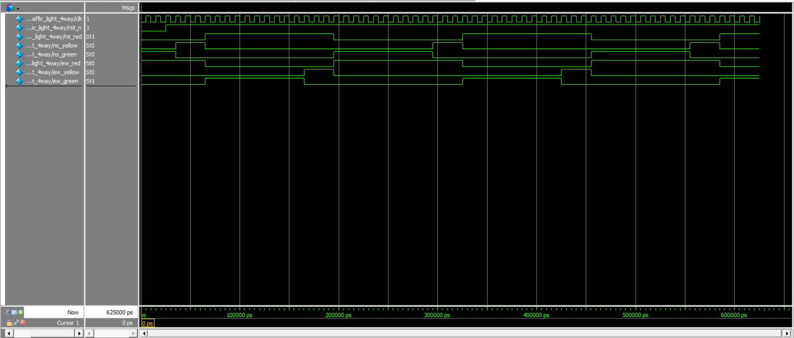

# 4-Way Traffic Light Controller — Verilog HDL

A robust 4-way traffic light control system implemented using a synchronous Finite State Machine (FSM). Designed in Verilog and verified using ModelSim Intel FPGA Starter Edition 2020.1.

## Features
- **3-Block FSM Architecture**: Separate blocks for state transitions, next-state logic, and output decoding for maximum stability.
- **Dual-Axis Control**: Manages North-South (NS) and East-West (EW) traffic flow.
- **Timed Transitions**: Parameterized cycles for Green (10 cycles) and Yellow (3 cycles) phases.
- **Safety First**: Default "Fail-Safe" state ensures no conflicting Green lights (no accidents!).
- **Active-Low Reset**: Initializing the system to a known safe state (NS-Green).

## Tools Used
- **Language**: Verilog HDL
- **Simulator**: ModelSim Intel FPGA Starter Edition 2020.1
- **Hardware Target**: Compatible with Altera/Intel Cyclone FPGAs

## File Structure
| File | Description |
|---|---|
| traffic_light.v | RTL Design (FSM Logic) |
| traffic_light_tb.v | Testbench for timing verification |
| traffic_light_waveform.png | Simulation waveform screenshot |

## Simulation Output
The waveform confirms the "staircase" transition where one axis remains Red while the other cycles through Green and Yellow.

## State Machine Logic
| State | NS Signal | EW Signal | Duration |
|---|---|---|---|
| **S_NS_GREEN** | Green | Red | 10 Cycles |
| **S_NS_YELLOW**| Yellow| Red | 3 Cycles |
| **S_EW_GREEN** | Red   | Green | 10 Cycles |
| **S_EW_YELLOW**| Red   | Yellow| 3 Cycles |

## How to Simulate
1. **Open ModelSim**: Create a new project and add `traffic_light.v` and `traffic_light_tb.v`.
2. **Compile**: Right-click and select "Compile All".
3. **Start Simulation**: Go to the Library tab -> work -> right-click `traffic_light_tb` -> Simulate.
4. **View Waves**: Add signals to the Wave window and type `run 500ns` in the transcript.
5. **Analyze**: Observe the timing counters and light transitions.

## Future Improvements
- Add a **Pedestrian Crossing** button input.
- Implement an **Emergency Vehicle** override sensor.
- Add a **Night Mode** (flashing yellow/red).
-
